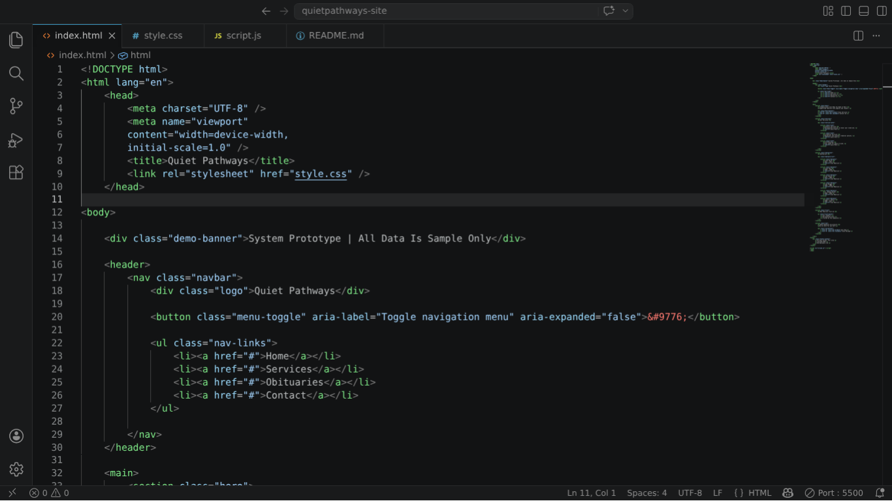
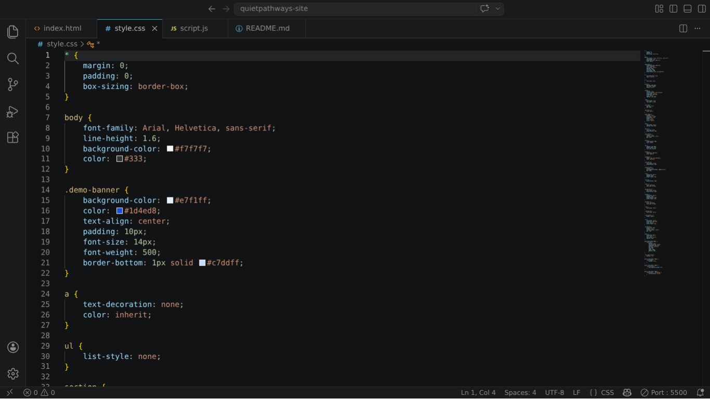
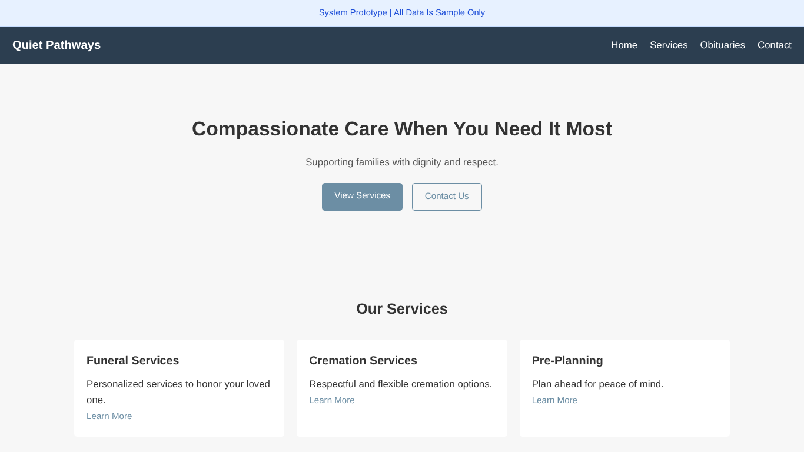

# Funeral Home Website

## Description
A static web-page built with HTML, CSS, and JavaScript. Demonstrating clear and accessible information for funeral homes and funeral services. This project focuses on foundational front-end skills using empathy driven UX.

## Features
- Clean structured layout using semantic HTML
- Custom styling using CSS for improved visual presentation
- Basic responsive and readable UI design (mobile, desktop)
- Simple navigation

## Tech Stack 
- HTML
- CSS
- JavaScript

## What I learned?
- Structuring a website
- Simple responsive layout design 
- Basic DOM manipulation with JavaScript
- Deploy a project on GitHub

## Future Implementation?
- Improve accessibility (ARIA roles)
- Obituary page with search/filter functionality
- Images and animations with descriptive alt text

## HTML Preview

## CSS Preview

## Website Preview

## Live Demo
